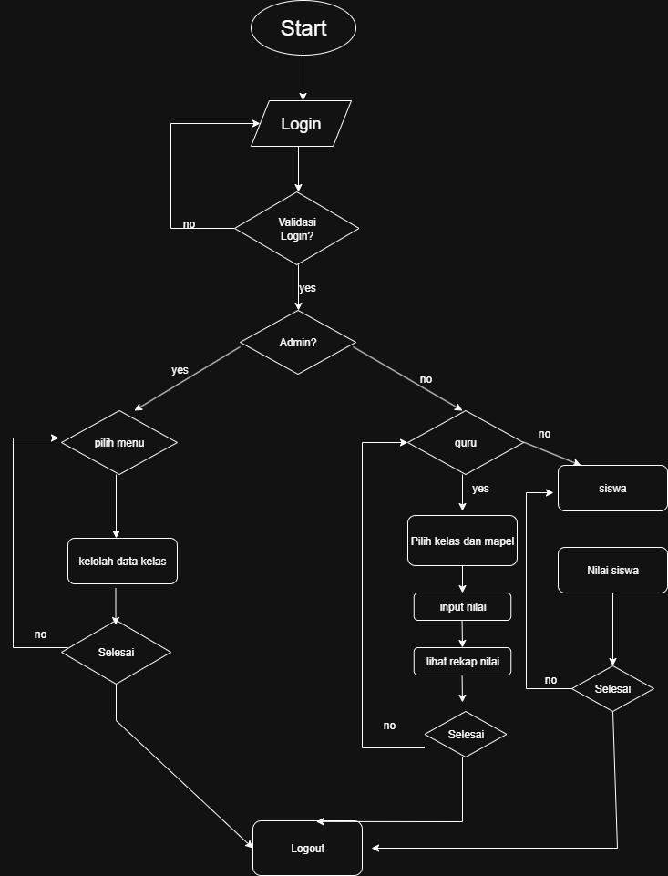

# nilai-siswa
# 📚 Aplikasi Monitoring Nilai Siswa

Aplikasi ini dirancang untuk membantu proses **monitoring nilai siswa** di lingkungan sekolah, dengan dukungan tiga level pengguna: **Admin**, **Guru**, dan **Siswa**.

---

## 👥 User Role dan Fungsinya

### 🔷 1. Admin
Sebagai pengelola utama sistem.

**Fitur yang dapat diakses Admin:**
- Kelola data guru
- Kelola data siswa
- Kelola akun pengguna
- Kelola jadwal pelajaran
- Lihat seluruh data nilai siswa
- Kelola kelas dan mata pelajaran

---

### 🟢 2. Guru
Sebagai penginput dan pengelola nilai siswa.

**Fitur yang dapat diakses Guru:**
- Melihat daftar siswa dalam kelas yang diajar
- Menginput nilai tugas, UTS, UAS, dll
- Melihat rekap nilai siswa
- Memberi catatan atau evaluasi siswa
- Monitoring absensi siswa

---

### 🟠 3. Siswa
Sebagai penerima informasi akademik pribadi.

**Fitur yang dapat diakses Siswa:**
- Melihat jadwal pelajaran
- Melihat nilai hasil belajar
- Melihat catatan dari guru
- Melihat status kehadiran (absensi)

---

## 🧭 Flowchart
📌 File: flowchart_nilai_siswa.drawio.png

---

## 📌 Struktur Folder (Opsional)
